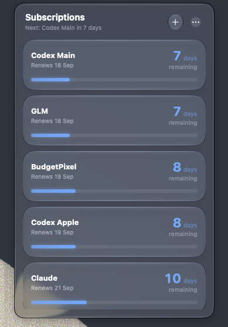

# subs

A small macOS menu bar app for keeping track of subscriptions that renew every 30 days.
It shows how many days are left until each renewal, with a Liquid Glass interface.

<p align="center">
  
</p>

## Features

- Lives in the menu bar, no Dock icon.
- Each subscription shows the days remaining in its current 30-day cycle and a progress bar.
  Click a card to switch between days remaining and days elapsed.
- Sorted by the nearest renewal; cards renewing within 3 days are highlighted.
  On the renewal day a card says *Renews today*; a subscription with a future start date
  counts down the days until it starts.
- Add (`⌘N`), edit (right-click → Edit…) and delete subscriptions. Deleting asks for
  confirmation inside the panel.
- Launch at Login, from the `⋯` menu, with a shortcut to System Settings when macOS
  asks for approval.
- If saving fails, for example on a full disk, the change is undone and the error is shown
  in the panel.
- If the data file can't be opened, the panel says so instead of crashing. *Start Fresh*
  moves the unreadable file to a backup folder next to it, never deleting it, and
  *Show in Finder* reveals it.
- English interface; dates follow your region's format.
- Light and dark app icon.

## Requirements

- macOS 27
- Xcode 27

## Build

1. Open `subs.xcodeproj` in Xcode.
2. Under *Signing & Capabilities*, select your own development team.
3. Build and run the `subs` scheme.

To install, build the Release configuration and copy `subs.app` to `/Applications`.
Launch at Login is meant to be used from there.

## Privacy

- Data is stored locally with SwiftData and never leaves your Mac.
- No networking, accounts, telemetry, or analytics.
- Built with the Hardened Runtime.

## Tests

The renewal cycle and store backup logic have unit tests written in Swift Testing. They run
without launching the app:

```bash
swift test --package-path Packages/SubsCore
```

## License

MIT. See [LICENSE](LICENSE).
